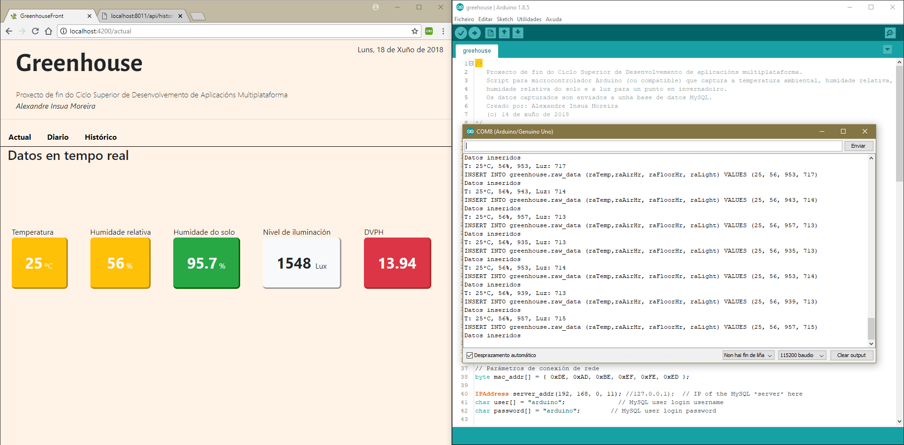

# TFC

## Abstract

*This repository contains the description and source code of the **Final Project** of 2-years upper vocational degree about cross-platform programming.
Its objective is to design and develop an application where the knowledge acquired during the training were applied.
Next, the operation of the components and the structure of the repository is explained.
Futher information, do not hesitate to contact me.*

*I maintain it as an objective evidence of its presentation.*

## Presentación

Este repositorio contén o código fonte do **Proxecto Final** do **Ciclo Superior de Desenvolvemento de aplicacións multiplataforma**. O obxectivo deste proxecto é deseñar e desenvolver unha aplicación onde se apliquen os coñecementos adquiridos durante a formación.
Mantéñoo como proba obxectiva da súa presentación.

## Concepto

A idea do proxecto consiste en simular a primeira iteración dun proxecto de software que ten como obxectivo automatizar o funcionamento do invernadoiro. Nesta primeira fase trátase de capturar un conxunto de datos medioambientais, mostralos nunha web e gardalos nunha base de datos.

### Elementos que forman a aplicación

#### Microcontrolador para a captura de datos

Para realizar a captura de datos usouse un microcontrolador Elego UNO (clónico de [Arduino UNO](https://www.arduino.cc "Arduino" )) cos seguintes sensores:

- **DHT11**: temperatura ambiente.
- **DHT11**: humidade relativa.
- **Moisture Sensor**: humidade.
- **Fotocélula 2PCS**: luminancia.

O script captura os datos, realiza o mapeo necesario e envía os datos a unha máquina mediante un cable RJ45. Para realizar isto, acoplóuselle un Shield Arduino Uno Ethernet W5100 R3.

#### Persistencia de datos

O script tiña a responsabilidade de enviar os datos a unha base de datos MySQL para o que se incorporou unha librería externa (Trátase do conector Arduino-MySQL de [Charles Bell](https://github.com/ChuckBell) "Charles Bell" ).
O servidor de base de datos realiza as seguintes funcións:

- Gardar os datos brutos (son todos de tipo enteiro) que recibe do microcontrolador.
- Procesa os datos brutos e os garda os datos procesados.
  
  - Calcula a **temperatura** en ºC.
  - Calcula a **humidade relativa** en %.
  - Calcula a **humidade do solo** en %.
  - Calcula a **luminancia** en LUX.
  - Calcula o **[Déficit de presión de vapor](https://www.semillas-de-marihuana.com/blog/dpv-deficit-presion-vapor/)**.

- Realiza o promedio dos valores e os garda.

#### Servidor

Consiste nunha aplicación en Javascript correndo en Node.js. Proporciona unha API para alimentar unha aplicación web con datos en formato JSON.

#### Aplicación web

A aplicación web foi desenvolvida usando o framework Angular (v. 6). Está formada por tres vistas:

- **Actual**: que mostra os datos en tempo real.
- **Diaria**: que mostra os promedios por hora do  actual.
- **Histórico**: que mostra un histórico dos datos.

#### Estrutura do repositorio

O repositorio consta das seguintes carpetas:

- **src**: contén o código fonte da aplicación.
  
  - Backend.
  - Frontend.
  - Script de Arduino.
  - Scripts sql.

- **captures**: contén captura de pantalla da aplicación en funcionamento.
- **pics**: fotos do microcontrolador en funcionamento.
- **videos**: vídeos do microcontrolador en funcionamento.
